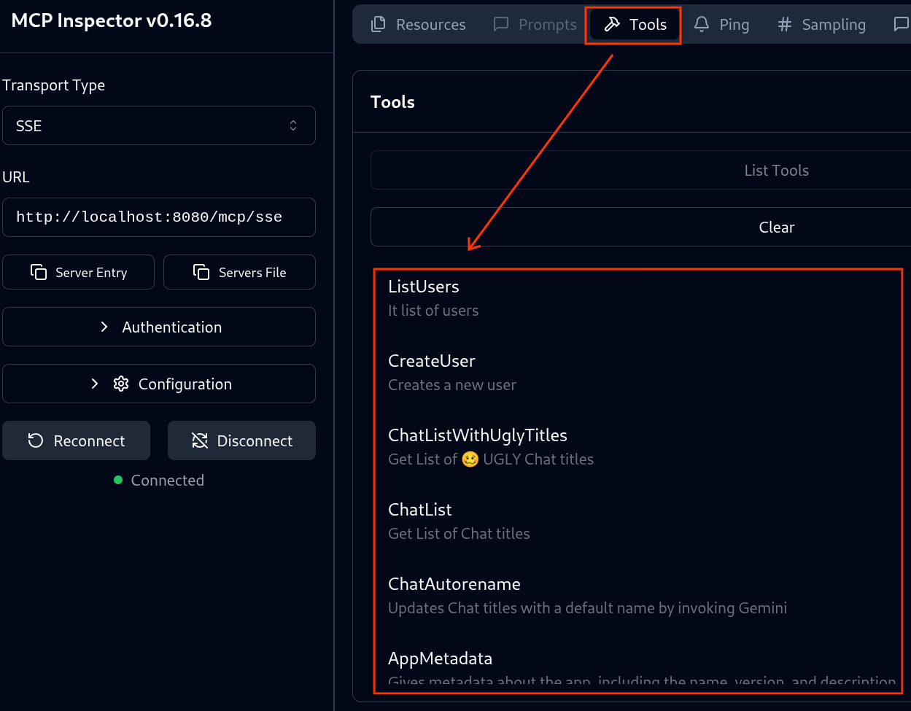

## Idea per il Workshop 🇮🇹

Una versione in Inglese è disponibile [qui](WORKSHOP.md).

## Prerequisiti

* Avere un account GMail 📧
* [opzionale] Avere un account github 🐙

## Installazione 💻

1. `git clone https://github.com:palladius/rails8-turbo-chat/`
2. `cd rails8-turbo-chat/`
3. `cp .env.dist .env`: ti servirà più tardi.
4. `cd rubyllm_chat_app/` - o quel che dice Christian, tipo `workshop/`

## Passo 1. Gratificazione Immediata ✨

<!-- **Perché**. Questo passo è per rendere l'utente felice e coinvolto con il minor sforzo possibile.
-->

In questo passo, installerai l'app e la farai partire.

TODO(Christian): `rails s` e setup del DB.

**Nota**. Dovrebbe funzionare tutto tranne le immagini e la chat, quindi forse dovremmo usare una sorta di generazione del DB (`rake db:seed`?) per generare una chat finta. Questo sarà un buon modo per mostrare l'app funzionante senza dover ancora configurare la chiave API: piccoli passi.

## Passo 2. Ottieni la Chiave API di Gemini e inizia a creare immagini. 🖼️

### 2a. Richiedi i crediti GCP..

<!-- **Perché**. In questo passo l'utente farà due cose:
    1. recuperare i crediti Cloud per usare Gemini (noioso), ma anche
    2. Usare quei crediti
-->

* recupera i crediti cliccando qui: https://trygcp.dev/e/devfest-maudna-25 facendo il login con il tuo account Google *personale*.
* Segui il link per ottenere `5$` in crediti. Basteranno per il workshop.
* Vai su https://aistudio.google.com/apikey e genera una CHIAVE API GEMINI. Annotala localmente nel tuo file `.env`, sotto `GEMINI_API_KEY`

### 2b. .. e usa Gemini alla grande! 🎉

Ora che hai fatto la parte noiosa, pronto a generare le tue prime immagini?

* riavvia l'app.
* Assicurati che la Chiave API di Gemini funzioni
  * Forse assicurati che una chiave API mancante mostri un avviso visibile in alto?
* Crea una nuova chat.
* Fai una domanda...
  * Osserva la magia: viene generata un'immagine e anche un riassunto della chat
  * TODO riccc: screenshot prima
  * TODO riccc: screenshot dopo

## Passo 3. Testa l'MCP esistente 🧪

<!--
Qui mostriamo che abbiamo già un MCP pre-costruito
-->

1. Facciamo troubleshooting con `npx @modelcontextprotocol/inspector`
2. Clicca sul link dalla CLI (nota l'MCP_PROXY_AUTH_TOKEN!), qualcosa come: `http://localhost:6274/?MCP_PROXY_AUTH_TOKEN=blahblahblah`
3. Configura:
   1. Tipo di trasporto: **SSE**
   2. URL: `https://localhost:8080/mcp/sse` - TODO(Christian), mi confermi che usiamo 8080? o 3000?
4. Clicca **connect**.
5. Se funziona, clicca su **Tools**
6. Clicca su **List Tools**.
7. Dovresti vedere questo: 

### Opzionale - testa lo stesso su vscode 🧑‍💻

1. Aggiungi https://localhost:8080/mcp/sse al tuo vscode, ad esempio in `.vscode/settings.json`.
2. Chiedi a copilot

## Passo 4. Aggiungi il tuo MCP personale 👨‍🎨

Ok, è ora di scrivere un po' di codice!

TODO(Chris): qualche idea su cosa possiamo aggiungere qui?
Dovremmo aggiungere qualcosa in `app/tools/`

* Idea di Ricc: forse potremmo:
* 1. aggiungere una migrazione che aggiunge un nickname o un `soprannome_modenese` alla classe User
* 2. eseguire la migrazione e aggiornare il DB
* 3. Testarlo localmente con `rails console`.
* 4. Una volta che funziona, ricarica l'MCP e chiedi

## Passo 5. Installa la CLI di Gemini e aggiungi questo. 🚀

* Installa la CLI di Gemini con npm:
  * `npm ..`
* Usa `gemini mcp` per aggiungere il nostro MCP dinamicamente:
  * `gemini mcp add --transport sse local-rails8-turbo-chat-sse https://localhost:8000/mcp/sse`
  * Questo configurerà gemini per avere questo MCP disponibile
* Avvia Gemini
* Chiedi "Quali sono i miei utenti?" (se non funziona: "Usa MCP per recuperare i miei utenti").
* Chiedi "Usa MCP per rinominare automaticamente tutte le chat".
  * Questo dovrebbe aggiornare magicamente i titoli delle chat per tutte le chat con nomi sbagliati.
