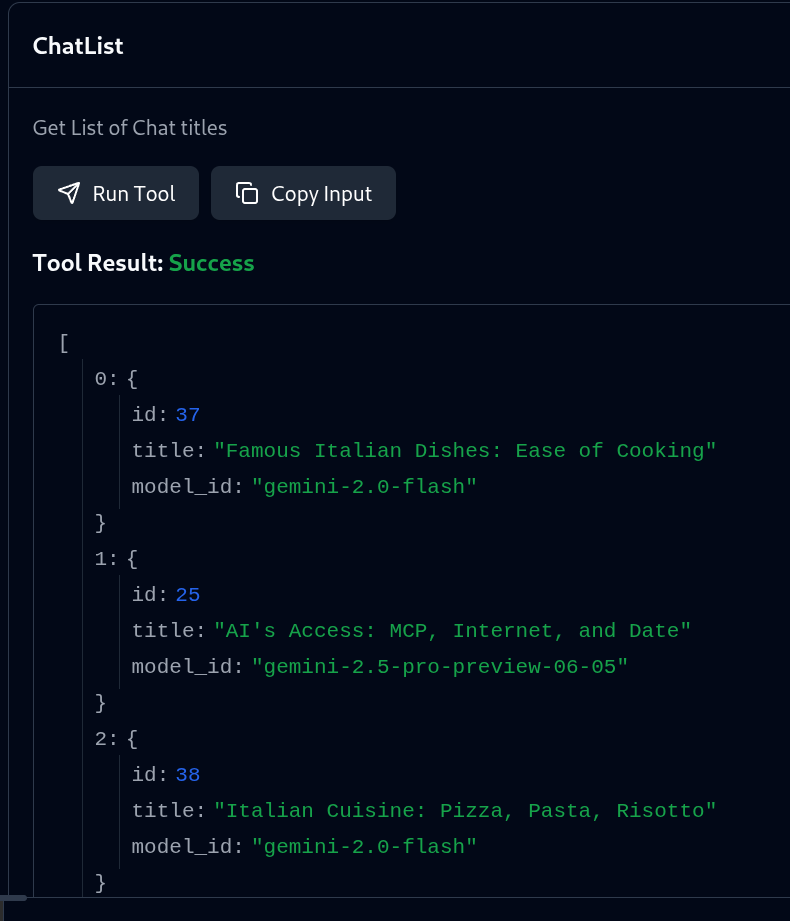

## Workshop Idea 🇮🇹

<!-- This is the master doc. Use `just translate-workshop-to-italian` to translate to IT -->

An Italian version is available [here](WORKSHOP-it.md).

## Prerequisites

* Have GMail account. This is needed to reclaim GCP credits, and to allow Gemini LLM to be used!
* [optional] Have github account. This is actua

## Install

1. `git clone https://github.com:palladius/rails8-turbo-chat/`
2. `cd rails8-turbo-chat/`
3. `cp .env.dist .env`: you'll need it later.
4. `cd rubyllm_chat_app/` - o quel che dice christian, tipo workshop/
5. TODO(Chris): some initial set up needed?
------

## Step 1. Instant gratification

<!-- **Why**. This step is about getting the user happy and engaged with as little effort as possible.
-->

In this step, you install the app and get it to run

TODO(Christian): `rails s` and DB set up.

**Note**. This should work with everything except the images and chat, so maybe we should use some sort of DB generation (`rake db:seed` ?) to generate a fake chat. This will be a good way to show the app working without having to set up the API key - yet: baby steps.

------

## Step 2. Get Gemini API Key and start creating images.

### 2a. Reclaim GCP credits..

<!-- **Why**. In this step the user will do two things:
    1. retrieve Cloud credits to use Gemini (boring), but also
    2. Use those credits
-->

* retrieve credits by clicking here: https://trygcp.dev/e/devfest-maudna-25 logging in with your *personal* Google account.
* Follow the link to get `5$` in credits. They will suffice for the workshop.
* Go to https://aistudio.google.com/apikey and generate a GEMINI API KEY. Note it locally in your `.env`, under `GEMINI_API_KEY`

### 2b. .. and use Gemini FTW!

Now that you've done the boring part, ready to generate your first images?

* restart the app.
* Ensure the Gemini API Key works
  * Maybe ensure that a missing API Key throws a visible warning on top?
* Create a new chat.
* Ask a question...
  * Observe the magic: an image is generated and a synopsis of the chat is also generated
  * TODO riccc: screesnthot before
  * TODO riccc: screesnthot afetr

------

## Step 3. Test existing MCP

<!--
Here we Show we have existing MCP already pre-built
-->

1. Lets troubleshoot with `npx @modelcontextprotocol/inspector`
2. Click on the link from CLI (note the MCP_PROXY_AUTH_TOKEN!), sth like: `http://localhost:6274/?MCP_PROXY_AUTH_TOKEN=blahblahblah`
3. Set up:
   1. Transport type: **SSE**
   2. URL: `https://localhost:8080/mcp/sse` - TODO(Christian), mi confermi usiamo 8080? o 3000?
4. Click **connect**.
5. If it works, click on **Tools**
6. Click List Tootls.
7. You should see this: 
8. Click on one tool to execute, for instance `Chat List`. Enjoy an output like this! Note the MCP Server is calling ActiveRecord here!

### Optional - test the same on vscode

1. Add https://localhost:8080/mcp/sse to your vscode, for instance under `.vscode/settings.json`.
2. Ask Copilot or Claude or your fav client sth like "Retrieve a list of chats: Any chat containing italian food?"

------

## Step 4. Add your own MCP

Ok, time to code something yourself!

TODO(Chris): any ideas what we can add here?
We should add something to app/tools/

* Ricc idea: maybe we could:
* 1. add a migration which adds a nickname or a `modenese_nickname` to the USer class
* 2. run migration and patch the DB
* 3. Test it locally with `rails console`.
* 4. Once it works, reload the MCP and ask

------

## Step 5. Install Gemini CLI and add this.

* Install [Gemini CLI](https://github.com/google-gemini/gemini-cli) with npm:
  * `npm install -g @google/gemini-cli`
  * See homepage for [alternative installations](https://github.com/google-gemini/gemini-cli?tab=readme-ov-file#-installation).
* Use `gemini mcp` to add our MCP dynamically:
  * `gemini mcp add --transport sse local-rails8-turbo-chat-sse https://localhost:8000/mcp/sse`
  * This will configure gemini to have this MCP available
* Start Gemini
* Ask "What are my users?" (if it doesnt work: "Use MCP to retrieve my users").
* Ask "Use MCP to Autorename all chats".
  * This should magically update chat titles for all wrongly named chats.
`

## Step 6. [optional] Persist images on GCS

<!--
This is a game changer, since a push to the cloud will persist images across computers and across local vs remote. But its hard to setup.
-->

TODO(Emiliano)

## Step 6. [optional] Build and launch to Cloud Run

<!-- once GCS is configured, and mayeb Emiliano can help, the rest is a breeze, at least for Riccardo -->

TODO(ricc)
